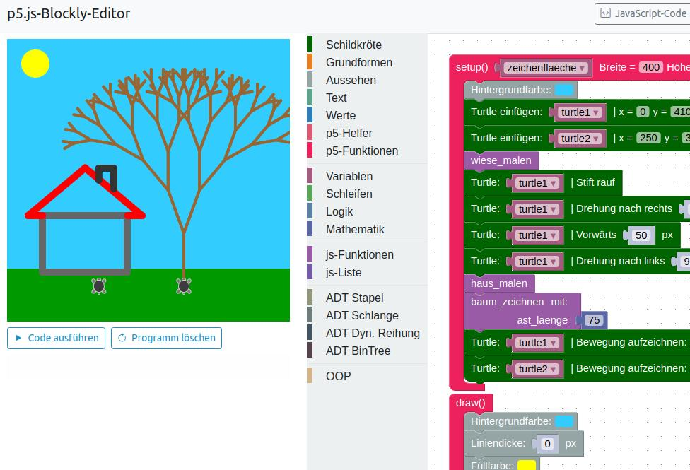
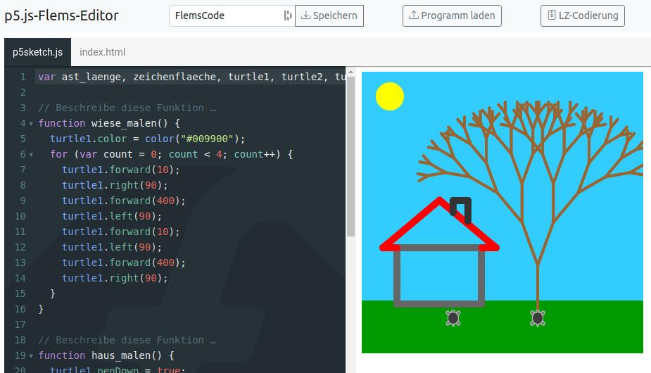
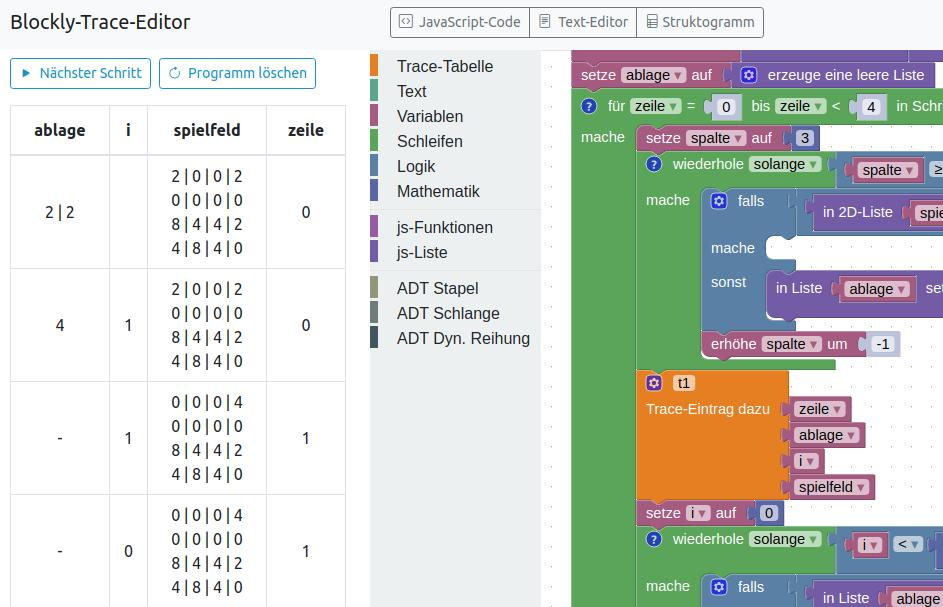

## Projektbeschreibung

Die drei Editoren **p5.js-Blockly-Editor**, **p5.js-Flems-Editor** und **Blockly-Trace-Editor** werden für den Einsatz im [Informatik-Unterricht](https://www.informatik.gym-wst.de) am [Gymnasium Westerstede](https://www.gymnasium-westerstede.de) entwickelt.

Für Programmier-AnfängerInnen ist die Programmierung im Text-Modus schwierig. Im Unterricht wird für die Suche nach Tippfehlern oder Syntaxfehlern viel Zeit verwendet und man verliert in der Vielfalt verfügbarer Anweisungen leicht die Orientierung. Bei einem **Block-Editor** spielen Tippfehler keine Rolle und mögliche Anweisungen findet man nach Kategorien angeordnet in der Toolbox. In den vergangenen Jahren wurden viele Block-Programmierumgebungen entwickelt, wie z.B. [Scratch](https://scratch.mit.edu/) oder [Open Roberta](https://lab.open-roberta.org/).

Im Informatik-Unterricht des Gymnasiums soll in der Qualifikationsphase im Textmodus programmiert werden, wobei in der Mittelstufe mit Block-Programmierung der Einstieg in die Programmierung erleichtern werden kann. Meist gibt es beim Übergang von der Block-Programmierung zur Text-Programmierung jedoch einen Bruch, da z.B. Scratch oder Open Roberta geschlossene System sind und die geschriebenen Programme nur innerhalb der gegebenen Infrastruktur ausgeführt werden können.

In diesem Projekt werden drei Editoren entwickelt, bei welchen die Block- und Textprogrammierung gleichzeitig möglich ist und die generierten JavaScript-Programme auch in anderen Umgebungen ausführbar sind. Dadurch kann im Unterricht ein bruchloser Übergang von der Block- zur Textprogrammierung erfolgen.

**Grafische Programmierung** kann für Programmier-AnfängerInnen motivierend sein, da Veränderungen im Programm unmittelbar sichtbar werden. Die Motivation kann weiter gesteigert werden, wenn man eine kleine Schildkröte durch Programmcode steuern kann. Grafische Programmierung kann mit der JavaScript-Bibliothek [p5.js](https://p5js.org/) deutlich erleichtert werden und ist in diesem Projekt eingebunden. Für die Block-Programmierung wird in diesem Projekt der Block-Editor [Blockly](https://github.com/google/blockly) verwendet.

Wenn im **p5.js-Blockly-Editor** ein Blockprogramm gebaut wurde, kann durch einen Klick auf die Schaltfläche "Text-Editor" aus den Blöcken JavaScript-Code generiert und in einem Text-Editor ausgeführt werden. Im Text-Editor kann das Programm dann weiter bearbeitet werden. Der Text-Editor basiert auf der [Flems-Sandbox](https://github.com/porsager/flems).

Im Informatik-Unterricht der Oberstufe werden Algorithmen als Programmiercode oder als Struktogramm gegeben. Auf der Basis eines gegebenen Algorithmus soll eine Tracetabelle mit Werten gefüllt werden. Im **Blockly-Trace-Editor** können Algorithmen in der Block-Programmierung erstellt und Schritt für Schritt ausgeführt werden. Während der schrittweisen Ausführung können Werte in eine Tracetabelle eingetragen werden. 

Aus dem Block-Programm kann automatisch ein **Struktogramm** erzeugt werden. Die Basis des Struktogramm-Editors ist die Bibliothek [Structogram Viewer](https://github.com/nigjo/structogramview). Aus dem Blockprogramm kann JavaScript-Code generiert werden. Der generierte JS-Code kann im Text-Editor ausgeführt und die Trace-Tabelle in der Konsole ausgegeben werden.

---

### Entwicklung

Die Editoren werden als statische Client-Applikationen ohne Verwendung eines Application-Frameworks oder Paket-Managers programmiert. Es werden keine Cookies gesetzt und es erfolgt keine Speicherung von Daten auf dem Server.

Die verwendeten Bibliotheken sind statisch in das Projekt eingebunden und werden unregelmäßig manuell aktualisiert. 

---

### Tutorial

Durch einen Klick auf die Schaltfläche mit dem Fragezeichen findet man in jedem Editor kleine Beispielprogramme.

---

### Verwendete Bibliotheken: 

- [Blockly](https://github.com/google/blockly) - [Apache License](https://github.com/google/blockly/blob/master/LICENSE)
- [p5.js](https://p5js.org/) - [GNU-LGPL](https://github.com/processing/p5.js/blob/main/license.txt)
- [Flems](https://github.com/porsager/flems) - [DWTFYWTP License](https://github.com/porsager/flems/blob/master/LICENSE)
- [p.turtle](https://github.com/jan-martinek/p.turtle) - [MIT License](https://github.com/jan-martinek/p.turtle/blob/master/LICENSE)
- [Bootstrap](https://getbootstrap.com/) - [MIT License](https://github.com/twbs/bootstrap/blob/main/LICENSE)
- [JQuery](https://jquery.com/) - [MIT License](https://jquery.org/license/)
- [Prism](https://prismjs.com/) - [MIT License](https://github.com/PrismJS/prism/blob/master/LICENSE)
- [LZ_String](https://github.com/pieroxy/lz-string/) - [MIT License](https://github.com/pieroxy/lz-string/blob/master/LICENSE)
- [JS-Interpreter](https://github.com/NeilFraser/JS-Interpreter) - [Apache License](https://github.com/NeilFraser/JS-Interpreter/blob/master/LICENSE)
- [Acorn JS-Parser](https://github.com/acornjs/acorn) - [MIT License](https://github.com/acornjs/acorn/blob/master/acorn/LICENSE)
- [Structogram Viewer](https://github.com/nigjo/structogramview) - [Apache License](https://github.com/nigjo/structogramview/blob/main/LICENSE)
- [Dom-to-Image](https://github.com/tsayen/dom-to-image) - [MIT License](https://github.com/tsayen/dom-to-image/blob/master/LICENSE)
- [Bootstrap Table](https://bootstrap-table.com/) - [MIT License](https://github.com/wenzhixin/bootstrap-table/blob/master/LICENSE)